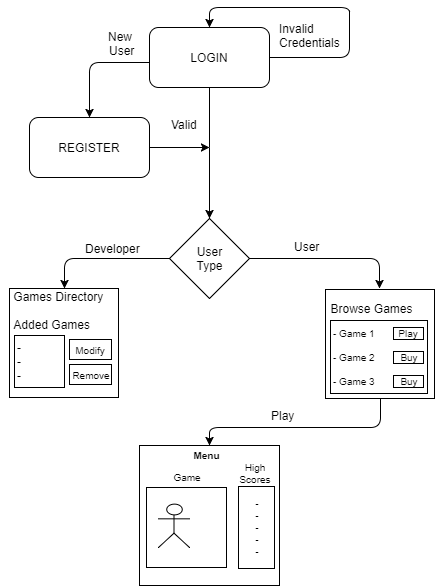

JS Game Store - A Django based javascript game store
-----------------------

### 1. Goal

In this project, we intend to develop an online game store for Javascript games. Our goal is to create a working application according to the planned scope and within the scheduled time. We plan to use HTML, CSS and BootStrap, and vanilla JS combined with jQuery as the front-end and Django as back-end framework. Moreover; modularity, security and robust testing of the application will also be our major focus areas during the development.

### 2. Usage of application
The url of our application is `https://wsd2017jsgamestore.herokuapp.com`   
You can of course use it by registering as an user or developer. There are already some existing accounts as well.    

When you login as a user, you come to the overview page where all bought games are listed as my games, and all others under buy games. From my games the user can play games by clicking on the icon or the title. Under buy games the user can buy games by clicking on the buy icon. Moreover, the user can search games by the search bar at the top of the page.

When you login as a developer, you come to the overview page where all added games are shown under your games. Here games can be edited and removed by clicking on the buttons. Moreover, there is the possibility to add a new game which directs you to the form. On the top bar, the developer can click on statistics where the statistics of all his games are shown. 

### 3. Plans

We have already identified a tentative view of the proposed application, see the next sections. Our plan is now to work out these views better by considering all use cases from various contexts e.g. a player, game developer etc. and sketching those views on paper. 

We will then further identify modules, entities and back-end components. The next step is to formulate integration mechanisms, explore the Django framework, frontend and APIs. We also have to deliberate on the hows and wheres of the data/credentials storage process.

We then continue to formation of the relations as identified earlier between the major entities of the application. We can then pen down the detailed work areas and divide them into modules. We will distribute the work areas into specific tasks and assign the tasks among the team.

We have identified the mandatory functional requirements written below. We will commence the implementation with the focus on those. 

#### Authentication and Authorization:

-	Registration with email validation (using Django's Console Backend)
-	Login and logout (using Django’s User Authentication System)
-	Development of front-end forms and API end points for Login/Register.
-	Password security mechanism (Hashing, storage, etc)

#### Player
A player type user can:

-	Browse and search the available (purchased) games through the home page.
-	Search and purchase offered games using mimic Payment Service API
-	Play the game (hosted in an iframe from the URL given by game developer)
-	View game's high scores while playing.
-	View high scores of all games in a separate view.

#### Developer
A game developer type user can:

-	Add games (via URL) and set price. 
-	Manage their games (remove, modify price).
-	View their added games and their sale statistics.

#### Game/Service Interaction

-	Messaging between the game and service.
-	Submission of scores by player to the game.
-	Addition of scores to the player’s scores list.

#### Security

-	Storage of password and session handling.
-	Allowing players to only play the games they’ve purchased.
-	Allowing developers to only modify their own games and add game to only their inventory.

#### 3.1. Model Work Flow
The schematic below shows the work flow of the application with the different views.

#### 3.2. Control Methods
We will implement the following control methods:

* Authentication and _not yet registered_ check.
* Registration based on email validation.
* User validation and routing based on user types.
* Allowing user and developers to add/modify their own games only.
* Validation of inputs and restricting any injection or cross scripting attempts.

### 3.3. Priorities
Following are our priorities in decreasing order:

-	Thorough analysis of the project scope at hand.
-	Development of Django modules pertaining to the major entities of the application: Player, Developer, Games, user authentication and management.
-	Implementation of views.
-	Focus on the security aspects of the app.
-	Keeping up with the planned schedule.
-	Comprehensive documentation and code cleanup.
-	Gold plating and additional functionalities.

### 4. Process and Time Schedule

Internal team communication will be done by using Slack and through meetings. We plan to commence implementation  after the christmas holidays.  

* Week 1: Project Initiation and Analysis.
* Weeks 2-4: Assignment of tasks and Back-end implementation on Django.
* Weeks 4-5: Front-end implementation.
* Weeks 5-6: Testing, gold plating and finalizing documentation.
* Week 7: Final deployment

### 5. Testing
We will execute several tests in order to make our application works correctly. Those are the following:

- Creation of test cases based on various use cases in the app.
- Unit testing of the modules.
- Integration testing with API(s), payment service and games.
- White box testing of particular logic code snippets. 
- Black box testing of the whole application.

### 6. Risk Analysis
In order to minimize the risk of our application failing, we will pay extra attention to the following things:

- All security related matters.
- Storage should be scalable enough to handle moderate data load.
- Exception handling. Front-end should never get stuck or crash.
- APIs response efficiency. 
- Password policy and credentials handling. 

